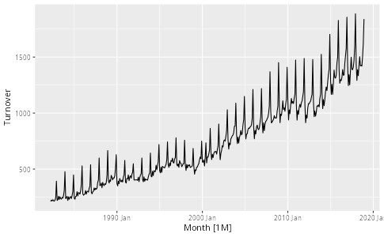
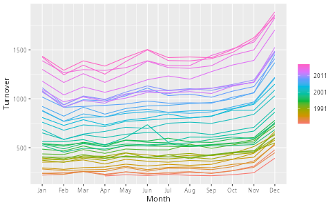

# Notas de estudio

## Dataframes y Tibbles

Un dataframe es un conjunto de vectores de longitud igual pegados lado a lado como columnas. Cada columna es un vector ordinario, de tal forma que tiene un solo tipo. Cada fila es el i-ésimo elemento de cada columna.

Un tibble es la versión Tidyverse de un dataframe, y es lo que fpp3 usa.

Puedo armar un Tibble sencillito con 2 vectores:

```R
mes <- c("Ene", "Feb", "Mar")
ventas <- c(10, 12, 9)
DF = tibble(mes, ventas)
DF
```

El resultado es:

```text
# A tibble: 3 × 2
  mes   ventas
  <chr>  <dbl>
1 Ene       10
2 Feb       12
3 Mar        9
```

Para sacar como vector una columna del tibble/DF, uso el signo de pesos. A diferencia de la mayoría de los lenguajes de programación, donde hay que entrecomillar el nombre de la columna, aquí no se hace eso. Esto aparece después en los parámetros de funciones sin comillas.

```R
> DF$ventas
[1] 10 12  9
```

Saco la cantidad de filas con nrow()

```R
> nrow(DF)
[1] 3
```

## Los 2 principales verbos de dplyr

dplyr es una librería que, principalmente, ofrece los 2 principales verbos: `filter()` y `mutate()`. filter() deja únicamente las filas que hacen que la condición del segundo parámetro sea TRUE, y mutate() añade o modifica columnas.

filter() y mutate() se prestan para usarse con sintaxis de pipe, como si fuera un comando de UNIX shell que transforma o hace algo con la stdin y tira a stdout como `pbzip2` o `sha256sum`.

Así, si le doy `filter(<columna> <operador> <valor>)` a un DF, me aislará únicamente las filas que cumplan la condición.

```R
> DF
# A tibble: 3 × 2
  mes   ventas
  <chr>  <dbl>
1 Ene       10
2 Feb       12
3 Mar        9

> DF |> filter(ventas > 9)
# A tibble: 2 × 2
  mes   ventas
  <chr>  <dbl>
1 Ene       10
2 Feb       12
```

Si quiero introducir una columna calculada, uso `mutate(<nueva columna>=<columna existente> <expresión>)`

```R
> DF |> mutate(doble=ventas*2)
# A tibble: 3 × 3
  mes   ventas doble
  <chr>  <dbl> <dbl>
1 Ene       10    20
2 Feb       12    24
3 Mar        9    18
```

## Ubicación en memoria de los DF y tibbles

```R
> DF
# A tibble: 3 × 2
  mes   ventas
  <chr>  <dbl>
1 Ene       10
2 Feb       12
3 Mar        9
```

## tsibble

tsibble es una librería que maneja tibbles especializados en series de tiempo. Lo que le añade a los tibbles es una columna _index_ que cuenta el tiempo, y columnas _key_ que identifican a qué serie pertenece cada fila, de tal forma que una tabla puede tener múltiples series.

El paquete de librerías fpp3 incluye un dataset bajo la variable global `aus_retail`, que es internamente un tsibble:

```R
> aus_retail
# A tsibble: 64,532 x 5 [1M]
# Key:       State, Industry [152]
   State                        Industry                                 `Series ID`    Month Turnover
   <chr>                        <chr>                                    <chr>          <mth>    <dbl>
 1 Australian Capital Territory Cafes, restaurants and catering services A3349849A   1982 Apr      4.4
 2 Australian Capital Territory Cafes, restaurants and catering services A3349849A   1982 May      3.4
 3 Australian Capital Territory Cafes, restaurants and catering services A3349849A   1982 Jun      3.6
 4 Australian Capital Territory Cafes, restaurants and catering services A3349849A   1982 Jul      4  
 5 Australian Capital Territory Cafes, restaurants and catering services A3349849A   1982 Aug      3.6
 6 Australian Capital Territory Cafes, restaurants and catering services A3349849A   1982 Sep      4.2
 7 Australian Capital Territory Cafes, restaurants and catering services A3349849A   1982 Oct      4.8
 8 Australian Capital Territory Cafes, restaurants and catering services A3349849A   1982 Nov      5.4
 9 Australian Capital Territory Cafes, restaurants and catering services A3349849A   1982 Dec      6.9
10 Australian Capital Territory Cafes, restaurants and catering services A3349849A   1983 Jan      3.8
# ℹ 64,522 more rows
# ℹ Use `print(n = ...)` to see more rows
```

Cuando mostramos un tsibble, podemos ver cómo el encabezado nos dice el intervalo entre registros de nuestra serie de tiempo ([1M] = 1 mes), así como la cantidad de series distintas que se pueden sacar de la tabla ([152]).

## autoplot y gg_season

`autoplot()` sirve para graficar fácil y sencillo una columna de un tsibble.

**Nota:** aquí el parámetro no va entre comillas, porque el parámetro es una columna de dataframe; autoplot() tirará una línea horizontal "vacía" si aquí paso `autoplot("Turnover")`, porque interpretará el nombre entre comillas como "graficar la constante literal "Turnover""; si paso `autoplot(Turnover)`, ahí sí lo interpreta como "graficar la columna Turnover". Esto nos lleva al escenario: **¿qué pasa si el nombre tiene espacios?** Se encierra entre \`acentos graves\`.

- La regla de dedo es que, si un parámetro es un valor simple que escribiría en una celda, va entre comillas; si un parámetro es un vector o columna, no lleva comillas.
- Esto es posible, porque R evalúa los parámetros con flojera; es decir, la función recibe la expresión sin evaluar y puede decidir de dónde sacar su significado.

```R
mi_serie |> autoplot(Turnover)
```



Esto me muestra automáticamente la serie con el eje de tiempo integrado al tsibble.

`gg_season()` es una función que sirve para explorar estacionalidad de forma visual. Igual que autoplot(), le paso la columna que quiero explorar:

```R
mi_serie |> gg_season(Turnover)
```



Con esto confirmo que mi serie efectivamente tiene un pico en Diciembre. Veo también un piquito en Junio, que en Australia es el fin del año fiscal australiano, por lo tanto el último mes para comprar cosas deducibles de impuestos y el último mes para vender todo y así los negocios muestren mejores números.
